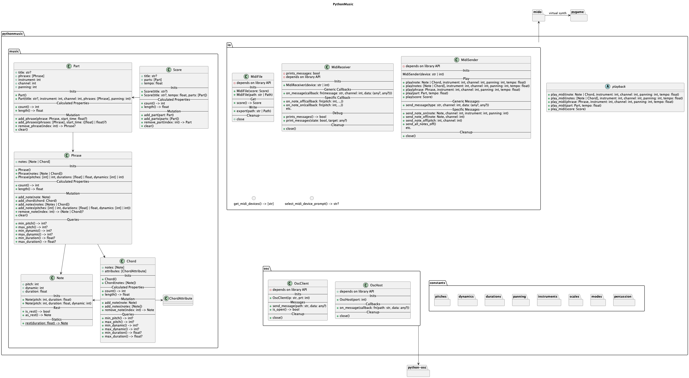

# PythonMusic
*make music with your computer*

PythonMusic is an open-source music library written in pure Python that enables you to write music on your computer.
It is based on the [mido](https://github.com/mido/mido) library, which enables interaction with midi files.


## Requirements
This library requires Python `>=3.10`.

## Install
All of Python's dependencies should be downloaded automatically when installing this library. Check `pyproject.toml`
for an overview.


### FluidSynth
Optionally, this library supports on-device playback via [FluidSynth](https://github.com/FluidSynth/fluidsynth).
The installation of FluidSynth may differ depending on you operating system. For more information, see FluidSynth's
[download page](https://github.com/FluidSynth/fluidsynth/wiki/Download).


#### Windows
TODO!

FluidSynth can run on Windows natively without issue (according to forums), but requires manual building as official 
builds are no long provided on GitHub. The instructions to do so are quite strait forward, but still require some
know-how. 

Alternatively, FS can also be downloaded using a Windows package manager. This is akin to the installation method
with macOS' Homebrew, but most people wont have this on Windows.

We can provide a build to students of course, but may run into Microsoft certification problems (Windows warning
users that our build may contain viruses). I don't have a suitable Windows installation at hand, so I can't test
this.

#### macOS
Install FluidSynth using [Homebrew](https://brew.sh/).

```bash
brew install fluidsynth
```

#### Linux
Install FluidSynth with your favourite package manager.

```bash
# Arch
pacman -S fluidsynth

# Debian / Ubuntu
apt install fluidsynth
```

### SoundFont
Additionally, you will need to download a GM (General Midi) compatible SoundFont2 library to use FluidSynth. These 
can be found readily online. Make sure to save the `*.sf2` file in a location that is accessible to your Python
project.

To load a sound font, simply pass its path to a `Synth` or `SynthPlayer`.

```python
from pythonmusic import Synth, SynthPlayer

# sound font is located in myProject/resources/gm.sf2
PATH = "resources/gm.sf2"

synth = Synth(PATH)
synth_player = SynthPlayer(PATH)
```


## Classes



## Links
- [Source](https://gitup.uni-potsdam.de/music-with-pc/pythonmusic)
- [Documentation](https://gitup.uni-potsdam.de/music-with-pc/pythonmusic)
- [JythonMusic](https://jythonmusic.me)
