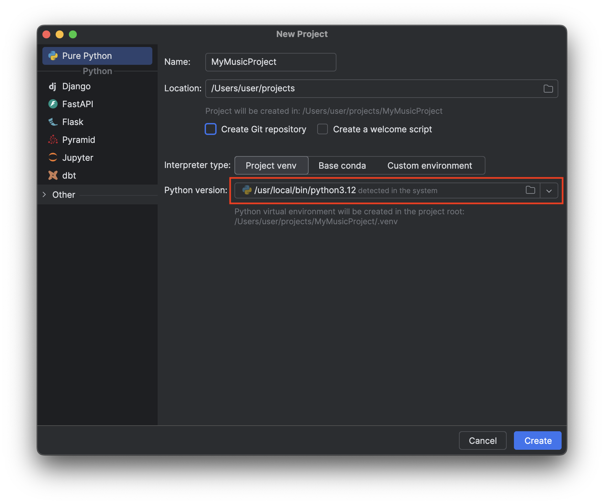
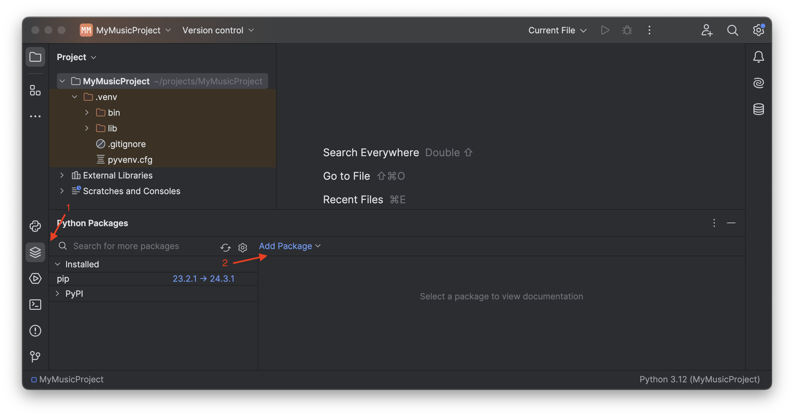
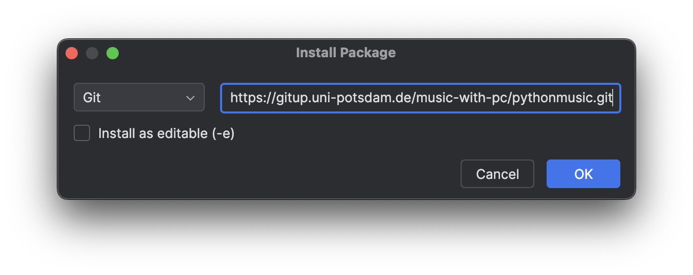
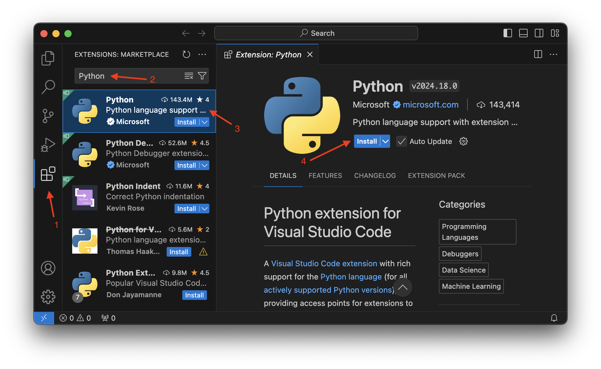
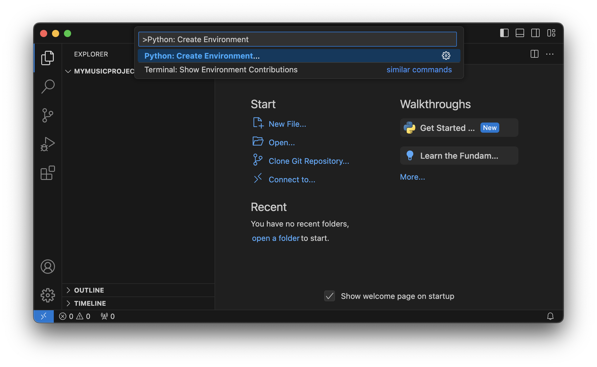

Installation
============

Requirements
------------

This library requires a Python version ``>=3.11`` to be installed on your system. To install Python, refer to the official `Python download page <https://www.python.org/downloads/>`_, or install using your operating system's package manager.

To check the installed Python version on your system, open a terminal or command prompt and use the command below:

.. code-block:: bash

   $ python3 --version

Installing this library and its dependencies also requires Python's Pip package installer. A normal Python installation should install 
this automatically.

.. note:: If you are using an IDE, the steps to install the correct Python version may vary. Consult your IDE's documentation on how to install Python.

Additional Windows Dependencies
...............................

.. important:: This step must be completed **before** installing PythonMusic, otherwise you may need to remove and reinstall ``python-rtmidi`` after this step before continuing.

PythonMusic on Windows requires 
`Microsoft Build Tools for Visual Studio 2022 <https://visualstudio.microsoft.com/downloads/?q=build+tools>`_.
After downloading and running the installer, select the *Desktop development with C++* package in the workloads section. To minimise the
disk space needed for installation, you can deselect all optional features in the side bar on the right side **except the current 
version of the MSVC build tools and Windows SDK**. Click on install.

.. note::
  If you have previously installed Visual Studio or the build tools itself, make sure that the *Desktop development with C++* workload is
  installed. Visual Studio can be used instead of the build tools, as long as the same dependencies are installed.

Synth
-----

Optionally, this library supports on-device playback through `FluidSynth <https://www.fluidsynth.org/>`_ and a GM (General MIDI)
compatible SoundFont2 library.

SF2 libraries can be found online. For a good starting point, have a look at a `Default Windows MIDI Soundfont <https://musical-artifacts.com/artifacts/713>`_ or 
`FluidR3 GM2-2.SF2 <https://www.dropbox.com/s/xixtvox70lna6m2/FluidR3%20GM2-2.SF2>`_.

Linux / macOS
.............

Use your favourite package manager to install FluidSynth. macOS doesn't ship with a built-in package manager, so you may want to install
`Homebrew <https://brew.sh/>`_.

.. code-block:: bash

   # Arch-based
   sudo pacman -S fluidsynth

   # Debian-based / Ubuntu
   sudo apt install fluidsynth

   # macOS with Homebrew
   brew install fluidsynth

For more information, see FluidSynth's `download page <https://github.com/FluidSynth/fluidsynth/wiki/Download>`_.

Windows
.......

.. todo:: This is bad, clunky, and dangerous. Find a better solution. Python (RtMidi, really) doesn't see FS installed via Chocolatey,
    even though it should. Passing the path to FS (Chocolatey) manyally to the C library loader, actually works. To fix this, however
    we would need to fork RtMidi or the python C loader. Not going to do that.

Download the latest Windows 10 release of FluidSynth from the  `official download page <https://github.com/FluidSynth/fluidsynth/releases>`_.
Extract the files from the zip, you will only need the contents of the ``bin\`` directory.
Drag and drop all files from the ``bin\`` directory to ``C:\Windows\System32``. This may require admin privileges.

.. note:: Windows does not ship with a built-in package manager. Alternatives such as `Chocolatey <https://chocolatey.org/>`_ exist, but 
   installing FluidSynth this way did not work during testing.

To uninstall FluidSynth, remove the DLLs you moved to ``System32``. Be careful not to remove other DLLs. This may break your system.

Creating a Project
------------------

PythonMusic is a normal Python library that can be added to your projects. Below you will find instructions for setting up PythonMusic
in PyCharm, Visual Studio Code, and the terminal. For other IDE and environments, consult their respective documentation.

.. note:: All instructions below that need to be run in the terminal assume that the ``python`` command is available. If this command is not found, try using ``python3`` instead.

.. important:: The instructions below may not work while the project's repository is not public. Instead, download the repo as a zip and install locally.

In PyCharm
..........

.. note:: If you are adding PythonMusic to an existing project, you can skip the first step. Make sure that your Python version is supported.

Create a new project make sure that a Python version ``>=3.11`` is selected. This is the minimum supported version by this library and may not be selected by default.

Once the new project has loaded, open the "Python Packages" toolbar by click on the corresponding button in the sidebar. Next, select
"Add Package" and then "From Version Control.

In the "Install Package" dialogue, enter the PythonMusic repository URL (``https://gitup.uni-potsdam.de/music-with-pc/pythonmusic.git``).
Do not select "Install as editable (-e)". Click on "OK".

PyCharm should now clone and install the PythonMusic git repository. Once the process is complete, PythonMusic is installed into your 
environment and available to your project. See :doc:`Getting Started <./getting_started>` to start making music.

.. note:: If the installation fails, try cloning via SSH. For this, use ``git@gitup.uni-potsdam.de:music-with-pc/pythonmusic.git``,
   instead.

In Visual Studio Code
.....................

Install the Python extension for VS Code from the Extension Marketplace.

Open VS Code inside a new folder, or if already present, your existing project.

Creating the Environment
~~~~~~~~~~~~~~~~~~~~~~~~

As a code editor, VS Code does not create a Python environment automatically. Instead, you create an environment manually by either
using the installed Python plug-in or the terminal.

The Python plug-in for VS Code can create a virtual environment for you. For this, go to the "View" menu in the menu bar, and select
"Command Palette...". Search for "Python: Create Environment".

Afterwards, select "Venv" and a compatible Python version (``>=3.11``).

Open a terminal by selecting the "New Terminal" option from the "Terminal" menu item. Continue with the instructions for a terminal
setup below. Skip the first step, if you have setup the environment above.

In the Terminal
...............

.. _from_vs_full:

Creating the Environment
~~~~~~~~~~~~~~~~~~~~~~~~

In the terminal, we need to create the virtual environment manually. Starting in Python ``3.4``, this can be done using the *venv* module. The command below will create a new environment.

.. code-block:: bash

   python -m venv venv

.. _from_vs_partial:

Activate the Environment
~~~~~~~~~~~~~~~~~~~~~~~~

Activating the environment differs depending on your operating system.

Linux and macOS
***************

On Linux and macOS, the *source* command is used to activate the environment. The script to do so can be found in ``./venv/bin/activate``.

.. code-block::

   source venv/bin/activate

Windows
*******

On Windows, activate the environment by running the activate script. Which script to run depends on the type of console you are using.

.. code-block:: powershell

   # in powershell
   venv\Scripts\Activate.ps1

   # in command prompt (cmd.exe)
   venv\Scripts\activate.bat

Adding PythonMusic
~~~~~~~~~~~~~~~~~~

In your activated environment, install PythonMusic with pip.

.. code-block:: bash

   pip install git+https://gitup.uni-potsdam.de/music-with-pc/pythonmusic
   # or
   pip install https://gitup.uni-potsdam.de/music-with-pc/pythonmusic.git

See :doc:`Getting Started <./getting_started>` to start making music.
