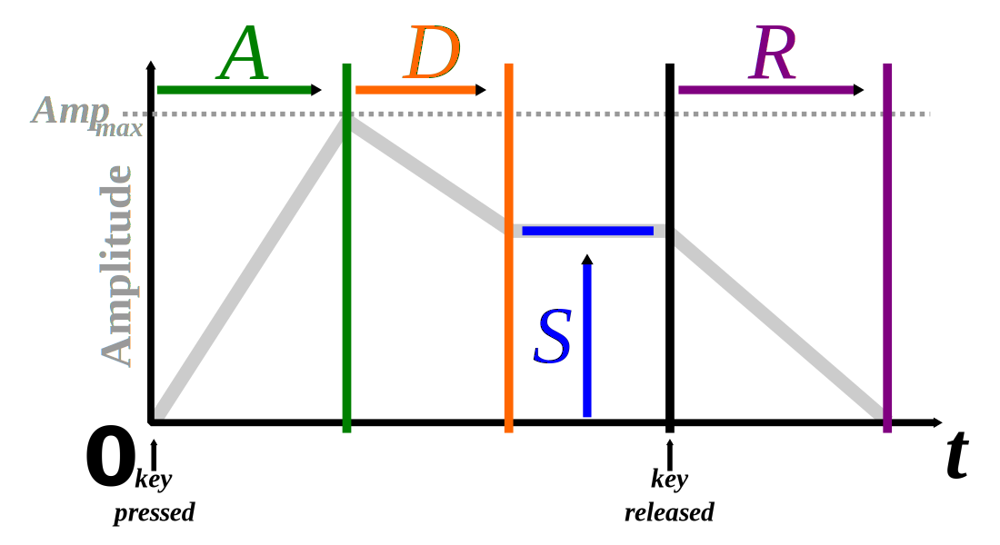

Synthesizer
===========

The :obj:`SynthesizerTarget <pythonmusic.play.SynthesizerTarget>` is a :obj:`Target <pythonmusic.play.Target>` implementation that
generates sound on your device from :obj:`Oscillators <pythonmusic.play.Oscillator>`.

The Synthesizer
---------------

To create a synthesizer, you need to pass an oscillator to the initialiser. Optionally, you can also define attack, decay, sustain, and release.

.. code-block:: python

    synth1 = SynthesizerTarget(SineOscillator())
    synth2 = SynthesizerTarget(
        SquareOscillator(),
        0.01,  # attack
        (0.2, 0.4),  # (decay duration, decay amount)
        None,  # sustain; None -> hold for duration of note
        0.3  # fall off for 0.3 seconds
    )

ADSR Envelope
.............

The :obj:`SynthesizerTarget <pythonmusic.play.SynthesizerTarget>` implements a simple ADSR envelope
(Attack, Decay, Sustain, Release).

   By Abdull, CC BY-SA 3.0, https://commons.wikimedia.org/w/index.php?curid=1729613

``attack`` defines the duration it takes the note to reach its full volume. Once that has been reached, it decays. You can define the 
duration and amount of decay as a tuple that you pass to ``decay``. If you ``sustain``, the note will continue to play for that many seconds.
Alternatively, you can also set ``sustain`` to ``None``, in which case it will continue until the synthesizer is notified that the note should 
end. The note finally decreases in volume to zero for ``release`` seconds.

Reference
.........

.. autoclass:: pythonmusic.play.SynthesizerTarget
   :no-index:
   :members:
   :undoc-members:
   :show-inheritance:

The Oscillator
----------------------

The synthesizer uses an oscillator to generate sound. You can create your own oscillators by inheriting from the
:obj:`Oscillators <pythonmusic.play.Oscillator>` class, and implementing the :meth:`sample() <pythonmusic.play.Oscillator.sample>` method.

A simple sine oscillator can be implemented as such:

.. code-block:: python

   from pythonmusic import *
   import math

   class SimpleSineOscillator(Oscillator):
       def sample(self, t: float, phase: float, amplitude: float) -> float:
           return math.sin(t + phase) * amplitude

Reference
.........

.. autoclass:: pythonmusic.play.Oscillator
   :no-index:
   :members:
   :undoc-members:
   :show-inheritance:
