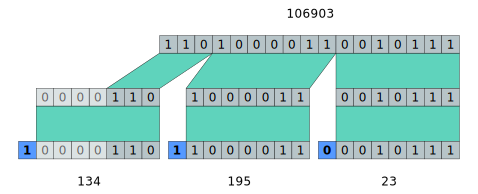

Midi
=============

Midi Messages
-------------

PythonMusic introduces a small abstraction layer on top of midi messages. 

The :obj:`Message <pythonmusic.midi.Message>` class stores midi message data in byte-form, but
provides several class methods to construct messages semantically and properties to access
message parameters.

Message Types
.............

==============  =========================================================================
Message Type    Midi Message
==============  =========================================================================
NOTE_OFF        ``Message.new_note_off(channel: int, key: int, velocity: int)``
NOTE_ON         ``Message.new_note_on(channel: int, key: int, velocity: int)``
POLYTOCH        ``Message.new_aftertouch(channel: int, key: int, pressure: int)``
CONTROL_CHANGE  ``Message.new_control_change(channel: int, control: int, value: int)``
PROGRAM_CHANGE  ``Message.new_program_change(channel: int, program: int)``
AFTERTOUCH      ``Message.new_channel_pressure(channel: int, pressure: int)``
PITCHWHEEL      ``Message.new_pitch_bend(channel: int, value: int)``
SYSEX           ``Message.new_system_exclusive(manufacturer: list[int], data: list[int])``
QUARTER_FRAME   ``Message.new_time_code_qf(type: int, value: int)``
SONGPOS         
SONG_SELECT     ``Message.new_song_select(song: int)``
TUNE_REQUEST    ``Message.new_tune_request()``
CLOCK           ``Message.new_clock()``
START           ``Message.new_start()``
CONTINUE        ``Message.new_continue_song()``
STOP            ``Message.new_stop()``
ACTIVE_SENSING  ``Message.new_active_sensing()``
RESET           ``Message.new_reset()``
==============  =========================================================================

Parameters Types and Ranges
...........................

===========  ======================
Parameter    Range           
===========  ======================
channel      0..15                 
frame_type   0..7                  
frame_value  0..15                 
control      0..127                
note         0..127                
program      0..127                
song         0..127                
value        0..127                
velocity     0..127                
data         (0..127, 0..127, ...) 
pitch        -8192..8191           
pos          0..16383              
time         any integer or float  
===========  ======================

Variable Length Quantity (VLQ)
..............................

While most midi message parameters are represented by a known, fixed number of bytes, a few parameters, such as *time* in
midi files, are encoded using a variable length quantity (vlq). In a vlq, integers are encoded into a series of bytes, where
the first 7 bits of each byte represent a chunk of the source integer, and the most significant bit (msb) indicates whether
the vlq ends or should continue to be read.

   By Wonderstruck (talk) - Own work, Public Domain, `link <https://commons.wikimedia.org/w/index.php?curid=30211332>`_

When decoding a vlq to an integer, seven bits are continuously read and bit-shifted to the right while the msb is ``1``. 
Once the msb is ``0``, the decoder has reached the last seven bits of the vlq and the integer has successfully been decoded.

This library provides the :meth:`vlq_to_int <pythonmusic.util.vlq_to_int>` and :meth:`int_to_vlq <pythonmusic.util.int_to_vlq>` functions 
to convert between an integer and a vlq.
